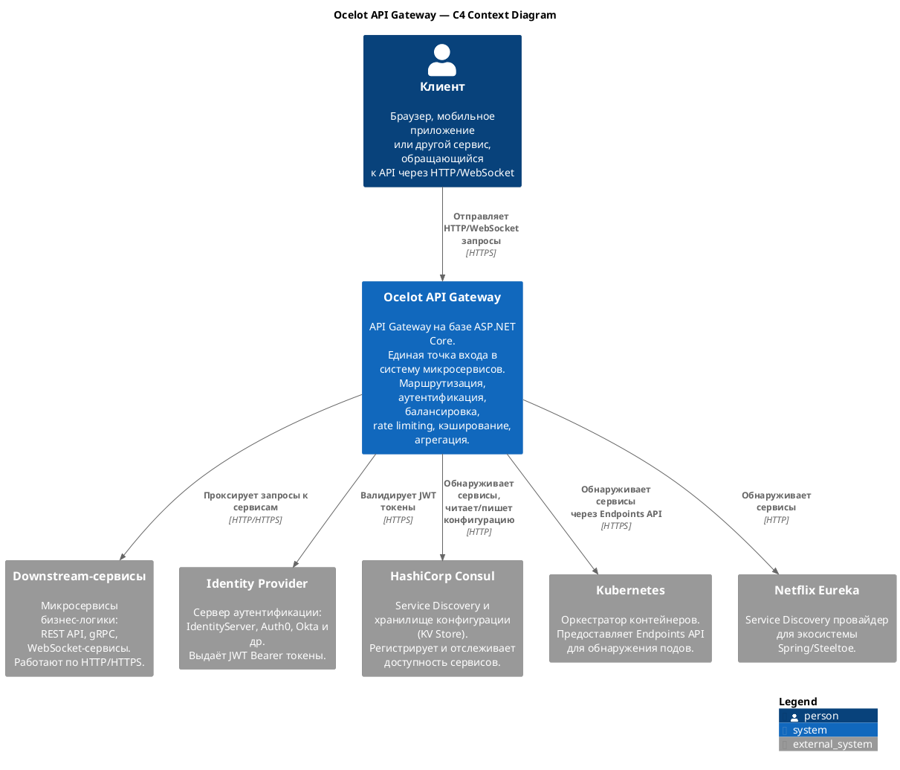
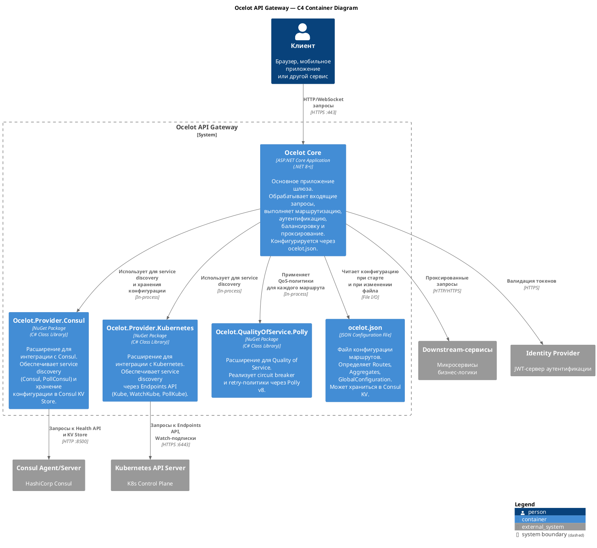
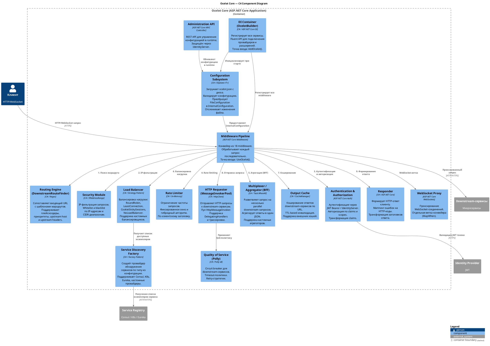

# Архитектурный анализ проекта Ocelot

## Содержание

1. [Введение](#введение)
2. [Архитектурные паттерны](#архитектурные-паттерны)
3. [Карта модулей](#карта-модулей)
4. [C4-диаграммы](#c4-диаграммы)
   - [C4 Context — уровень системы](#c4-context--уровень-системы)
   - [C4 Container — уровень контейнеров](#c4-container--уровень-контейнеров)
   - [C4 Component — уровень компонентов](#c4-component--уровень-компонентов)

---

## Введение

> Подробное описание проекта, его возможностей и технологического стека см. в [detailed-description.md](./detailed-description.md).

С архитектурной точки зрения Ocelot реализован как **конвейер ASP.NET Core middleware**, выстроенных в строго определённом порядке. Каждый входящий HTTP-запрос последовательно проходит через 18 middleware-компонентов — от маршрутизации и аутентификации до балансировки нагрузки и проксирования. Ответ от downstream-сервиса возвращается обратно через тот же конвейер.

Ключевая архитектурная особенность — **высокая расширяемость через DI**: практически каждый компонент (балансировщик, провайдер service discovery, агрегатор, middleware) заменяется или дополняется без изменения ядра.

---

## Архитектурные паттерны

### 1. Middleware Pipeline (Цепочка обязанностей)

Основной архитектурный паттерн проекта. Все запросы обрабатываются последовательно через 18 middleware-компонентов, выстроенных в строгом порядке в методе `BuildOcelotPipeline`. Каждый middleware выполняет свою задачу и передаёт управление следующему через `RequestDelegate next`.

```
ConfigurationMiddleware
  → ExceptionHandlerMiddleware
    → ResponderMiddleware
      → DownstreamRouteFinderMiddleware
        → MultiplexingMiddleware
          → SecurityMiddleware
            → HttpHeadersTransformationMiddleware
              → DownstreamRequestInitialiserMiddleware
                → RateLimitingMiddleware
                  → RequestIdMiddleware
                    → AuthenticationMiddleware
                      → ClaimsToClaimsMiddleware
                        → AuthorizationMiddleware
                          → ClaimsToHeadersMiddleware
                            → ClaimsToQueryStringMiddleware
                              → LoadBalancingMiddleware
                                → DownstreamUrlCreatorMiddleware
                                  → OutputCacheMiddleware
                                    → HttpRequesterMiddleware
```

### 2. Strategy (Стратегия)

Применяется в нескольких ключевых точках расширяемости:

- **Балансировщики нагрузки** — интерфейс `ILoadBalancer` с реализациями `RoundRobin`, `LeastConnection`, `CookieStickySessions`, `NoLoadBalancer` и возможностью подключения кастомных балансировщиков
- **Провайдеры Service Discovery** — интерфейс `IServiceDiscoveryProvider` с реализациями `Consul`, `PollConsul`, `Kube`, `WatchKube`, `PollKube`, `Eureka` и кастомными провайдерами
- **Агрегаторы ответов** — интерфейс `IResponseAggregator` с реализацией `SimpleJsonResponseAggregator` и поддержкой пользовательских агрегаторов через `IDefinedAggregator`

### 3. Factory (Фабрика)

Используется для создания объектов с выбором конкретной реализации в runtime:

- `LoadBalancerFactory` — создаёт нужный балансировщик по типу из конфигурации
- `ServiceDiscoveryProviderFactory` — создаёт провайдер service discovery по типу
- `InMemoryResponseAggregatorFactory` — выбирает агрегатор для маршрута
- `QoSFactory` — создаёт политику Quality of Service (Polly pipeline)
- `DelegatingHandlerFactory` — создаёт цепочку `DelegatingHandler` для HTTP-клиента

### 4. Repository (Репозиторий)

Абстрагирует хранение и получение конфигурации:

- `IInternalConfigurationRepository` / `InMemoryInternalConfigurationRepository` — хранение внутренней конфигурации в памяти
- `IFileConfigurationRepository` / `DiskFileConfigurationRepository` — чтение конфигурации с диска
- `ConsulFileConfigurationRepository` — хранение конфигурации в Consul KV Store

### 5. Builder (Строитель)

Fluent API для конфигурирования Ocelot при старте приложения:

- `IOcelotBuilder` / `OcelotBuilder` — регистрация всех сервисов, добавление провайдеров, балансировщиков, агрегаторов, delegating handlers
- `OcelotPipelineConfiguration` — конфигурирование конвейера middleware с возможностью переопределения отдельных шагов

### 6. Decorator (Декоратор)

Применяется для расширения функциональности без изменения базовых классов:

- `ConfigAwarePlaceholders` — декорирует `IPlaceholders`, добавляя поддержку плейсхолдеров из конфигурации
- `DefaultConsulServiceBuilder` — базовый класс с виртуальными методами, который можно переопределить для кастомизации построения downstream-хоста из данных Consul

### 7. Observer / Change Tracking (Наблюдатель)

Реализует реактивное обновление конфигурации без перезапуска приложения:

- `OcelotConfigurationChangeTokenSource` — источник токенов изменения конфигурации
- `OcelotConfigurationMonitor` — реализует `IOptionsMonitor<IInternalConfiguration>` для отслеживания изменений
- `IOptionsMonitor<FileConfiguration>` — ASP.NET Core механизм отслеживания изменений файла конфигурации с автоматической перезагрузкой

### 8. BFF / Gateway Aggregation (Агрегация на шлюзе)

Паттерн Backend for Frontend реализован через:

- `MultiplexingMiddleware` — разветвляет один входящий запрос на несколько параллельных запросов к downstream-сервисам (`Task.WhenAll`)
- `IResponseAggregator` — объединяет ответы в единый JSON-ответ
- `IDefinedAggregator` — позволяет реализовать кастомную логику агрегации

---

## Карта модулей

| Модуль | Назначение | Ключевые интерфейсы | Зависимости |
|--------|-----------|---------------------|-------------|
| **Middleware** | Конвейер обработки запросов, точки расширения | `OcelotMiddleware`, `OcelotPipelineConfiguration` | Все остальные модули |
| **Configuration** | Загрузка, валидация, преобразование и хранение конфигурации | `IInternalConfiguration`, `IInternalConfigurationCreator`, `IFileConfigurationRepository` | DependencyInjection |
| **DependencyInjection** | Регистрация всех сервисов, fluent API для расширений | `IOcelotBuilder`, `OcelotBuilder` | Все модули |
| **DownstreamRouteFinder** | Поиск downstream-маршрута по URL, методу, заголовкам | `IDownstreamRouteProvider`, `IDownstreamRouteProviderFactory` | Configuration |
| **LoadBalancer** | Балансировка нагрузки между экземплярами downstream-сервиса | `ILoadBalancer`, `ILoadBalancerFactory`, `ILoadBalancerHouse` | ServiceDiscovery, Configuration |
| **ServiceDiscovery** | Обнаружение downstream-сервисов | `IServiceDiscoveryProvider`, `IServiceDiscoveryProviderFactory` | Configuration |
| **Authentication** | Аутентификация входящих запросов | `AuthenticationMiddleware` | ASP.NET Core Authentication |
| **Authorization** | Авторизация по claims и scopes | `IClaimsAuthorizer`, `IScopesAuthorizer` | Authentication, Claims |
| **Claims** | Трансформация claims из токена в заголовки, query string, path | `IAddClaimsToRequest`, `IAddHeadersToRequest`, `IAddQueriesToRequest` | Authentication |
| **RateLimiting** | Ограничение частоты запросов | `RateLimitingMiddleware` | Configuration, Infrastructure |
| **Cache** | Кэширование ответов downstream-сервисов | `OutputCacheMiddleware`, `IOcelotCache<T>` | Configuration |
| **QualityOfService** | Circuit breaker через Polly | `IQoSFactory`, `QoSOptions` | Configuration, Polly |
| **Multiplexer** | Агрегация ответов нескольких downstream-сервисов (BFF) | `MultiplexingMiddleware`, `IResponseAggregator`, `IDefinedAggregator` | Configuration, Requester |
| **Requester** | Отправка HTTP-запросов к downstream-сервисам | `IHttpRequester`, `IMessageInvokerPool` | Configuration, QoS |
| **Responder** | Формирование HTTP-ответа клиенту | `IHttpResponder`, `ResponderMiddleware` | Errors |
| **Headers** | Трансформация заголовков запроса и ответа | `IHttpResponseHeaderReplacer`, `IHttpContextRequestHeaderReplacer` | Configuration |
| **Security** | IP-фильтрация (whitelist/blacklist) | `ISecurityPolicy`, `IPSecurityPolicy` | Configuration |
| **WebSockets** | Проксирование WebSocket-соединений | `WebSocketsProxyMiddleware`, `IWebSocketsFactory` | DownstreamRouteFinder, LoadBalancer |
| **Administration** | HTTP API для управления конфигурацией в runtime | `IFileConfigurationSetter`, `FileConfigurationController` | Configuration, Authentication |
| **Logging** | Структурированное логирование | `IOcelotLogger`, `IOcelotLoggerFactory` | Все модули |
| **Ocelot.Provider.Consul** | Service discovery и хранение конфигурации через Consul | `Consul`, `PollConsul`, `ConsulFileConfigurationRepository` | ServiceDiscovery, Configuration |
| **Ocelot.Provider.Kubernetes** | Service discovery через Kubernetes Endpoints API | `Kube`, `WatchKube`, `PollKube` | ServiceDiscovery |

---

## C4-диаграммы

### C4 Context — уровень системы

Диаграмма показывает Ocelot в контексте внешних систем и пользователей.



---

### C4 Container — уровень контейнеров

Диаграмма показывает основные контейнеры (развёртываемые единицы) Ocelot и их взаимодействие.



---

### C4 Component — уровень компонентов

Диаграмма показывает ключевые компоненты внутри Ocelot Core и их взаимодействие.


